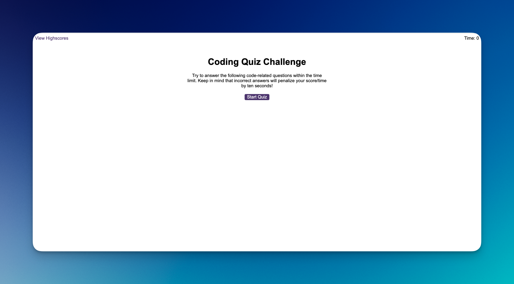

# edX Bootcamp - Module 6 Challenge

## Description

In this Challenge, I created a timed, multiple-choice coding quiz that can keep track of high scores and quiz-takers' initials.

Note: I am currently on the Front End Web Developer course.

## Table of Contents

- [Usage](#usage)
- [License](#license)

## Usage

1. [Click this link to visit the applicaton on Github pages](https://nadeemamdev.github.io/module-6-challenge/index.html)

2. Follow the instructions on-screen to get started. 

Screenshot of Live Site/Quiz Application:

## License

This is a private project and therefore no License has been provided.

## Credits

I have used ChatGPT to help me comment the finished code in a way that is professional, while I am still learning best practice on commenting. 
I have used ChatGPT to help me understand some JavaScript concepts as I progressed through the challenge, but a big effort has been made on keeping the code solutions original/my own.
